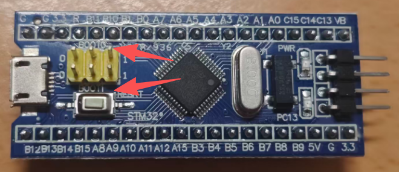
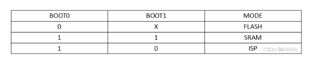

# 单片机从上电到执行main函数的过程

## 前言

滋滋滋~啪啦啪啦~我们敲下了自己的第一段代码，成功点亮了LED，实现了硬件界的Hello World！好像一切都那么简单，我们只需要写一个void main()，后面开始写自己的各种初始化和业务函数就可以。我们一定以为，程序就是从main函数开始执行，但事实真的如此吗，实际上并不是这样

## 上电的瞬间（硬件层面）

在刚刚上电的时候，VDD会上升到STM32的工作电压，内部的**POR/PDR**（上电/掉电复位与 **BOR**（欠压复位，若使能）保持芯片在复位状态，直到电源稳定。同样的，复位也会有这样的过程。在上电/复位后，时钟并不是我们外界的晶振，这里的内核默认跑的是**HSI 8MHz**，PLL也处于关闭状态，Flash也处于静默状态。

## 启动介质选择（Boot地址空间）

经历过上电后，板子就会决定，从哪里开始取出**初始栈指针MSP**和**复位向量PC**，这两个指针是由板子硬件赋值的，初始的地址分别是`[0x00000000]`和`[0x00000004]`，但是这个地址里面到底存了什么，详见后文



拿出手上的STM32F103C8T6，我们会很清晰的看见上面标注着BOOT0和BOOT1两个引脚，在拿到手的时候，这上面会默认接上了跳线帽，而单片机，就是依靠去读取这两个脚的电平，来选择给MSP和PC赋上什么值，根据引脚状态，启动项有以下几种：



这些分别对应的功能如下所示

### 主 Flash 启动（最常见）

上电后 MCU 把 **主 Flash（0x08000000）映射到 0x00000000**。

取 `[0x08000000]` 为 MSP，`[0x08000004]` 为 PC → 跳入 `Reset_Handler`。

程序从 startup 文件进入 `SystemInit()` → `main()`。

### 系统存储器启动（System Memory Bootloader）

当 **BOOT0=1, BOOT1=0** 时，
MCU 将内部 **System Memory**（固定在 ROM 中的 16~32 KB 区域）映射到 `0x00000000`。

这块区域内置 ST 官方的 **Bootloader**，用于 **在线编程 (ISP)**。

支持的通信接口（取决于型号）：

- **USART1（PA9/PA10）**
- **USART2（PA2/PA3）**
- **USART3（PB10/PB11）**
- **USB DFU（部分型号）**
- **CAN（部分型号）**

### SRAM 启动模式（调试用）

当 **BOOT0=1, BOOT1=1** 时，
MCU 将 **SRAM（0x20000000）映射到 0x00000000**。

从 `[0x20000000]` 取 MSP 和 PC。

## 矢量表与复位向量（取指第一步）

现在，我们通过设定的boot，取到了我们所需要的值，并且把他们赋值给了MSP和PC，这里我们按照flash模式来继续讲解

此时，MSP的值为`[0x08000000]`，这里是STM32内置的flash，PC的值为`[0x08000004]` ，此时我们去查阅一下程序里面的startup_stm32f10x_md.s这一项文件，下面为部分截取的代码

```c
; Vector Table Mapped to Address 0 at Reset
                AREA    RESET, DATA, READONLY
                EXPORT  __Vectors
                EXPORT  __Vectors_End
                EXPORT  __Vectors_Size

__Vectors       DCD     __initial_sp               ; Top of Stack
                DCD     Reset_Handler              ; Reset Handler
                DCD     NMI_Handler                ; NMI Handler
                DCD     HardFault_Handler          ; Hard Fault Handler
                DCD     MemManage_Handler          ; MPU Fault Handler
```

我们从`__initial_sp`这一项开始看起，这一项就是我们说的MSP的地址，第二项是PC指针的地方，这里对应的其实是一个名为`Reset_Handler`的函数

```c
; Reset handler
Reset_Handler    PROC
                 EXPORT  Reset_Handler             [WEAK]
     IMPORT  __main
     IMPORT  SystemInit
                 LDR     R0, =SystemInit
                 BLX     R0
                 LDR     R0, =__main
                 BX      R0
                 ENDP
```

在这里，首先程序会执行`SystemInit`这个函数，我们来看一下这个函数

```c
void SystemInit (void)
{
#if defined(STM32F100xE) || defined(STM32F101xE) || defined(STM32F101xG) || defined(STM32F103xE) || defined(STM32F103xG)
  #ifdef DATA_IN_ExtSRAM
    SystemInit_ExtMemCtl(); 
  #endif /* DATA_IN_ExtSRAM */
#endif 

  /* Configure the Vector Table location -------------------------------------*/
#if defined(USER_VECT_TAB_ADDRESS)
  SCB->VTOR = VECT_TAB_BASE_ADDRESS | VECT_TAB_OFFSET; /* Vector Table Relocation in Internal SRAM. */
#endif /* USER_VECT_TAB_ADDRESS */
}
```

我们先看上面这一坨代码，这里的意思是是不是有FSMC的大容量期间，但是C8T6属于中型容量，可以直接跳过，无需在意

至于下面这一坨，则是我们需要重点关照的，如果我们定义了`USER_VECT_TAB_ADDRESS`这一项，此时中断向量表，就处于用户自定义状态，会按照`VECT_TAB_OFFSET`来决定此时中断向量表地址和原来向量表偏移的位置，其实就是相当于基址+偏移，如果是新手的话，不建议修改这里，可能会让你的MCU处于工作异常的状态。至于为什么要有这一项，是为了完成一些更高阶的操作，比如bootloader这些

到这里可能会有些疑问，为什么这个函数叫`SystemInit`，但是里面为什么没有完成时钟这些的初始化，实际上是因为此时单片机还处于开机状态，保证能跑就行，至于去执行后面自己写的业务，那会才需要更精准的时钟，所以时钟的初始化，其实也放在了后面去执行。

执行完这个后，后面就要去执行`__main`这一段指令，这里就是我们最后要的main函数了吗？其实还不是，这里去执行的是初始化堆栈，拷贝.data，清零.abs，搭建C运行库这些操作，这个里面我们也是看不见代码的，这是ARM C 运行库提供的隐藏入口。

执行完这一项后!你的系统就可以开始执行main函数了

## 执行main函数

下面贴一段Cubemx的main函数

```c
int main(void)
{

  /* USER CODE BEGIN 1 */

  /* USER CODE END 1 */

  /* MCU Configuration--------------------------------------------------------*/

  /* Reset of all peripherals, Initializes the Flash interface and the Systick. */
  HAL_Init();

  /* USER CODE BEGIN Init */

  /* USER CODE END Init */

  /* Configure the system clock */
  SystemClock_Config();

  /* USER CODE BEGIN SysInit */

  /* USER CODE END SysInit */

  /* Initialize all configured peripherals */
  MX_GPIO_Init();
  /* USER CODE BEGIN 2 */

  /* USER CODE END 2 */

  /* Infinite loop */
  /* USER CODE BEGIN WHILE */
  while (1)
  {
    /* USER CODE END WHILE */

    /* USER CODE BEGIN 3 */
  }
  /* USER CODE END 3 */
}
```

我们可以发现,到了这会,单片机才开始去初始化时钟,再去执行我们后面的业务函数.

## 结语

看到这里,恭喜你已经完全了解了单片机从启动到执行main函数的全过程,下次将会深入讲解一下bootloader这些操作,来实现更加复杂的业务需求
