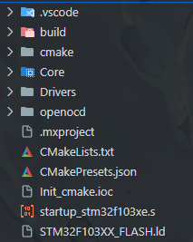
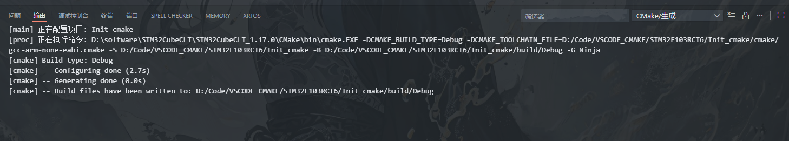
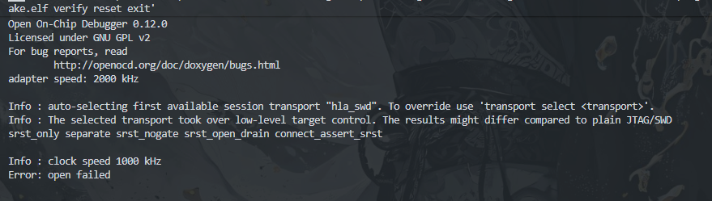

# VS Code + CMake 嵌入式通用工作流

> 本文所使用的完整工程示例与配置文件已开源，项目源码地址：  
> 👉 https://github.com/Lee6wang/VSCODE_CMAKE_STM32F103RCT6

## 第 0 章｜写在前面：为什么你需要读这份文档

如果你是一名嵌入式工程师，大概率经历过以下场景之一：

- 刚熟练 STM32 + CubeIDE，项目说要换 TI
- 刚适应 CCS，导师说“这个芯片性价比更高”
- 一个项目一个 IDE，电脑桌面像芯片厂商展会
- 工程文件拷给同事，对方说：“你这怎么打不开？”

于是你逐渐意识到一个事实：

> **你不是在写代码，你是在适配 IDE。**

而这份文档，正是写给那些**想要去寻找一个通用解决方案**的人。

## 第 1 章｜我们到底在解决什么问题？

在讨论工具、配置、命令之前，我们先做一件**看起来不那么技术，但非常关键的事**：
 ——**搞清楚我们到底在跟谁较劲。**
答案其实很少是“芯片太难”，而更多是下面这些更现实的问题。

### 1.1 厂商 IDE 的三大“传统美德”

先声明一句：
 **厂商 IDE 并不差。**
 它们只是站在了一个和你“长期工程目标”并不完全一致的位置上。
从工程视角来看，大多数厂商 IDE 都具备以下三大“传统美德”。

#### ① 全家桶，一步到位

厂商 IDE 通常会贴心地为你准备好一切：
- 编译器
- 构建系统
- 调试器
- 下载工具
- 工程模板
你只需要做一件事：
 👉 **点“New Project”。**
这在项目早期非常友好，甚至可以说是“幸福”。

#### ② 强绑定工程模型

但问题也从这里开始。
厂商 IDE 往往意味着：

- 工程结构是 IDE 定义的
- 构建逻辑藏在 GUI、XML 或私有文件中
- 一旦脱离 IDE，工程就“不可阅读”
你可能会遇到这种情况：

> “这个工程我能用，但我不知道它是怎么 build 出来的。”

这在工程规模变大之后，会逐渐变成一种隐患。

#### ③ 可用，但难迁移

当你想要：

- 升级 IDE
- 更换芯片
- 把工程交给另一个人
- 或者仅仅是复制到另一台电脑

你会发现，**工程和 IDE 已经深度绑定**。
很多时候，所谓“迁移工程”，实际上是：

> **在新的 IDE 里重新创建一份工程，然后把代码粘过去。**

### 1.2 一个非常常见、但很少被正视的工程生命周期

大量嵌入式项目，都会不自觉地走上这样一条路：

1. **项目初期**

   > “先用厂商 IDE，快点跑起来最重要。”

2. **项目中期**

   > “工程有点复杂了，不过还能忍。”

3. **项目后期**

   > “这个工程别动了，谁动谁背锅。”

这并不是工程师不愿意优化，而是：

> **工程从一开始，就被锁进了某个工具的思维模型里。**

### 1.3 “通用工作流”不是反对厂商 IDE

这里必须非常明确地说一句：

> **通用工作流 ≠ 抛弃厂商 IDE**

并不是要“革命”，也不是要“对抗”。
真正想做的，是一件很克制的事情：

- 把厂商 IDE 从“工程中心”
- 调整为“可选工具”

换句话说：

> **IDE 是工具箱，而不是工程本体。**

你可以用它调试、验证、查资料，
 但不必让它决定你的工程结构和生命周期。

### 1.4 那我们真正想要的是什么？

总结一下这一章的核心诉求：
我们希望拥有一套工程方式，使得：

- 换芯片 ≠ 换工程逻辑
- 换 IDE ≠ 工程重建
- 工程结构清晰、可读
- 多年后仍然能理解当初的设计

这就是 **“嵌入式通用工作流”** 要解决的问题。

## 第二章｜配置基本工具

### 2.1 工具链选择

在这套 `VS Code + CMake` 的嵌入式通用工作流中，我选择的工具链遵循一个简单原则：优先使用可独立于 IDE 存在、可通过命令行直接调用的工具。构建系统采用 CMake，用于统一描述工程结构和编译方式；构建执行器选择 `Ninja`，以获得干净且高效的构建体验；编译器根据平台分别使用 `arm-none-eabi-gcc`（STM32/ARM）和 `cl2000`（TI C2000），确保工具链本身不依赖任何厂商 IDE。烧录与调试则分别使用 OpenOCD 或 TI 的 UniFlash 等独立工具，使下载和调试成为可替换的工程动作，而不是 IDE 的专属能力。通过这样的选择，工程的构建、烧录和调试流程可以在 VS Code、命令行乃至自动化环境中保持一致，从而避免工程被绑定到某一个特定工具或开发环境中。

### 2.2 软件工具安装

首先，你需要安装如下软件工具：

- **VS Code**：微软出品的轻量级代码编辑器，支持丰富的插件生态。
- **CMake**：跨平台的构建系统生成工具，用于管理项目的构建过程。
- **Ninja**：一个小巧且高效的构建系统，适合与 CMake 配合使用。
- **编译器**：
  - 对于 ARM 平台，安装 `arm-none-eabi-gcc` 工具链。
  - 对于 TI C2000 平台，安装 TI 提供的 `cl2000` 编译器。
- **调试工具**：
  - 对于 ARM 平台，安装 OpenOCD。
  - 对于 TI C2000 平台，安装 TI UniFlash。
- MinGW 或 WSL（Windows 用户可选）：提供类 Unix 环境，方便使用命令行工具。

至于上面这些，我们需要怎么装，筑波在这里就不赘述了，网上有非常多的教程，大家可以自行搜索。下面提供一些参考链接：

- [VSCode 和 CMake 搭建嵌入式开发环境](https://www.freesion.com/article/29622627308/)

### 2.3 测试软件安装是否成功

安装完成后，可以通过命令行测试各个工具是否安装成功：

```bash
# 测试 VS Code
code --version
# 测试 CMake
cmake --version
# 测试 Ninja
ninja --version
# 测试 ARM 编译器
arm-none-eabi-gcc --version
# 测试 TI 编译器
cl2000 --version
# 测试 OpenOCD
openocd --version
# 测试 TI UniFlash
uniflash --version
```

如果以上命令均能正确输出版本信息，说明各个工具安装成功，可以进入下一步。

### 2.4 VS Code 插件安装

为了更好地支持 CMake 和嵌入式开发，可以安装以下 VS Code 插件：
- **CMake Tools**：提供 CMake 项目的构建和调试支持。
- **C/C++**：微软官方的 C/C++ 语言支持插件，提供代码补全、调试等功能。
- **Cortex-Debug**：专为 ARM Cortex-M 处理器设计的调试插件，支持多种调试器。
- **clangd**：基于 LLVM 的 C/C++ 语言服务器，提供智能代码补全和导航功能。

## 第三章｜创建第一个 CMake 嵌入式项目

### 3.1 创建项目目录结构

在这里，对于初学者来说，可以模仿CubeMx中的结构，我们先使用CubeMx生成一个基础工程，筑波在这里选择的是STM32F103RCT6芯片，生成其CMAKE工程，生成后我们可以看到如下目录结构：



让我们来简单介绍一下这个目录

```
project/
├─ CMakeLists.txt            # 工程入口，描述“工程是什么”（应保持简洁）
├─ CMakePresets.json         # 构建预设（Debug / Release / 不同工具链）
│
├─ cmake/                    # CMake 辅助模块目录
│  └─ toolchains/            # 交叉编译工具链定义（arm-gcc / ti-c2000 等）
│
├─ Core/                     # CubeMX 生成的核心应用代码
│  ├─ Inc/                   # 应用层与系统层头文件
│  └─ Src/                   # main.c、系统初始化、中断回调等
│
├─ Drivers/                  # 芯片厂商提供的底层驱动
│  ├─ CMSIS/                 # ARM CMSIS 内核与设备相关定义
│  └─ STM32F1xx_HAL_Driver/  # STM32 HAL 驱动实现
│
├─ STM32F103XX_FLASH.ld   # Flash / RAM 分布、中断向量位置
│
├─ startup_stm32f103xe.s     # 启动文件（复位向量、异常向量表）
│
├─ openocd/                  # 调试与烧录配置 (自己加的)
│  ├─ interface/             # 调试器接口配置（ST-LINK 等）
│  └─ target/                # 目标芯片配置（STM32F103）
│
├─ .vscode/                  # VS Code 工程操作配置
│  ├─ settings.json          # 编辑器与工具协作设置
│  ├─ tasks.json             # build / flash 等工程动作
│  └─ launch.json            # 调试入口（F5 行为）
│
├─ build/                    # 构建输出目录（不纳入版本控制）
│  ├─ Debug/                 # Debug 构建结果（elf / map / compile_commands）
│  └─ Release/               # Release 构建结果（可选）
│
├─ Init_cmake.ioc            # CubeMX 工程配置文件（代码生成输入）
└─ .mxproject                # CubeMX 工程元数据
```

当你打开这个目录时，VS Code 会自动识别 CMake 项目，并加载相关配置。接下来，我们可以开始编写 一点点自己的业务函数，比如在 `Core/Src/main.c` 中添加一个简单的 LED 闪烁代码。

### 3.2 编译项目

在 VS Code 中，按下 `Ctrl+Shift+P` 打开命令面板，输入 `CMake: Configure` 并回车，选择合适的构建预设（如 Debug）。配置完成后，再次打开命令面板，输入 `CMake: Build` 并回车，即可开始编译项目。编译结果会输出到 `build/Debug` 目录下。



当出现如上界面的时候，恭喜你，已经完成编译了。

### 3.3 烧录与调试

在 `VS Code + CMake` 工作流中，烧录和调试并不依赖厂商 IDE，而是通过**独立工具 + VS Code 配置文件**完成。整体思路很简单：

- **下载 / 调试工具独立存在**
- **VS Code 只负责调用**
- **所有配置都放在工程目录内**

### 3.3.1 烧录配置（以 OpenOCD 为例）

首先，在工程中准备 OpenOCD 配置文件，如我在文件里面已经写好的：

```
openocd/
├─ interface/
│  └─ stlink.cfg
└─ target/
   └─ stm32f1x.cfg
```

然后，在终端中即可直接完成烧录：

```
openocd -f openocd/interface/stlink.cfg \
        -f openocd/target/stm32f1x.cfg \
        -c "program build/Debug/project.elf verify reset exit"
```

这个时候，下面会出现烧录成功的信息：



至于为啥我这里显示失败，是因为我压根没连板子，大家不要在意。（手动狗头

为了方便使用，通常会将该命令封装到 VS Code 的 `tasks.json` 中，我在`.vscode`下也为大家提供好了：

```
{
  "version": "2.0.0",
  "tasks": [
    {
      "label": "build (ninja)",
      "type": "shell",
      "command": "cmake",
      "args": ["--build", "${command:cmake.buildDirectory}"],
      "problemMatcher": ["$gcc"],
      "group": "build"
    },
    {
      "label": "flash (openocd, stm32f1)",
      "type": "shell",
      "command": "openocd",
      "args": [
        "-f", "openocd/interface/stlink.cfg",
        "-f", "openocd/target/stm32f103.cfg",
        "-c", "init",
        "-c", "reset init",
        "-c", "program ${command:cmake.launchTargetPath} verify reset exit"
      ],
      "problemMatcher": [],
      "dependsOn": ["build (ninja)"]
    }
  ]
}
```

之后只需在 VS Code 中执行该任务即可完成烧录。

### 3.3.2 调试配置（launch.json）

调试通过 VS Code 的 `launch.json` 配置完成。在这里我也为大家提供一个例子：

```
{
  "version": "0.2.0",
  "configurations": [
    {
      "name": "Debug STM32F103 (ST-LINK + OpenOCD)",
      "type": "cortex-debug",
      "request": "launch",
      "cwd": "${workspaceFolder}",
      "executable": "${command:cmake.launchTargetPath}",
      "servertype": "openocd",
      "configFiles": [
        "openocd/interface/stlink.cfg",
        "openocd/target/stm32f103.cfg"
      ],
      "runToEntryPoint": "main",
      "preLaunchTask": "flash (openocd, stm32f1)"
    }
  ]
}
```

配置完成后，按 `F5` 即可进入调试模式，支持：

- 断点
- 单步执行
- 变量查看
- 寄存器与内存查看

### 3.3.3 常见工程习惯

在实际工程中，通常遵循以下习惯：

- **烧录与调试配置纳入版本控制**
- **`build/` 目录不提交**
- **路径使用相对路径，避免机器相关配置**
- **不同芯片使用不同 OpenOCD target 文件**

这样配置后，工程在不同电脑、不同开发者之间可以直接复用。

### 3.3.4 小结

通过 OpenOCD + VS Code 的简单配置，即可完成：

- 命令行烧录
- VS Code 一键调试
- 与厂商 IDE 解耦的开发体验

到此为止，一个完整的 **CMake + VS Code 嵌入式工程** 已经具备了**编译、烧录和调试**的基本能力。

## 第四章｜结语：一套可以继续生长的工作流

到这里为止，这篇文章已经完整地走过了一条最基本的路径：

- 使用 CMake 描述嵌入式工程
- 使用 VS Code 作为统一操作入口
- 完成编译、烧录与调试
- 尽量减少工程对厂商 IDE 的依赖

但需要说明的是，这并不是一套“终极方案”，甚至也不是一套“标准答案”。
它更像是一个**起点**。

### 4.1 这套工作流并不完美

在真实工程中，仍然有大量值得继续探索和打磨的地方，例如：

- 多芯片、多工具链工程如何更优雅地组织
- BSP / Middleware / Application 的边界如何定义
- 各类下载器、调试器之间的差异与兼容性
- CMake 在嵌入式场景下的最佳实践仍在演进
- 与 CI、自动化测试、版本管理的进一步结合

这些问题，并不会因为换一个工具就自动消失。

### 4.2 真正重要的不是工具，而是工程意识

如果这篇文章只能传达一个核心观点，那它应该是：

> **工程不是由 IDE 决定的，而是由结构、边界和可维护性决定的。**

无论你最终选择：

- VS Code 还是其他编辑器
- CMake 还是其他构建系统
- OpenOCD、J-Link 还是厂商工具

只要你开始主动思考：

- 工程是否可迁移
- 构建过程是否可复现
- 工程是否能被他人理解

那么你已经走在一条正确的工程道路上。

### 4.3 写给正在路上的你

如果你刚开始接触这套工作流，觉得：

> “好像有点麻烦。”

那很正常。
工程的复杂度从来不会消失，它只会在**早期显性暴露**，或者在**后期集中爆发**。
选择一种更通用、更可控的工程方式，本质上只是把问题放在了**更早、更可管理的阶段**。

### 4.4 继续探索，而不是照抄答案

这篇文章并不希望你完全照抄某一个目录结构、某一份配置文件，
 而是希望你在自己的工程中不断调整、删减、演化。
当你有一天能够：

- 自如地切换工具
- 清楚每一层代码的职责
- 不再害怕工程迁移和交接

那这套工作流，才真正成为了你自己的东西。
如果你愿意，这篇文章也可以只是一个开始。
 它可以继续扩展、拆分，甚至被完全推翻。
但只要你开始用**工程的眼光**看待嵌入式开发，
 那么你已经比“只会点 IDE 的按钮”向前走了一大步。

最后！送大家一句话！
**Make it work. Make it better.**
