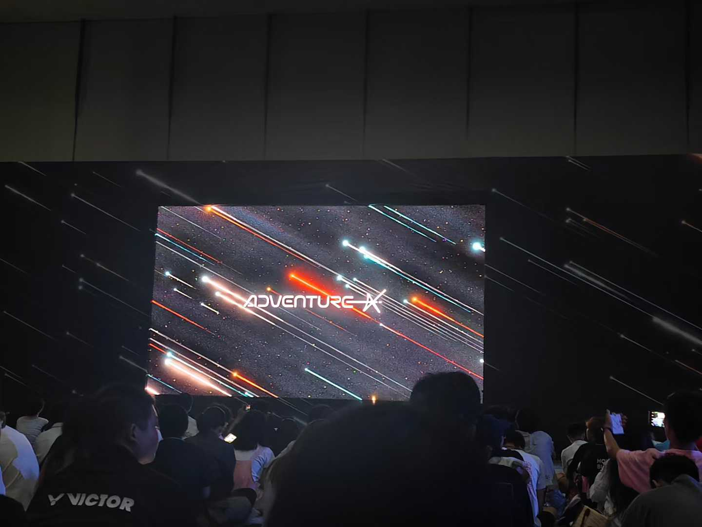

# 2025的我，思考了哪些

## 1 引言

今天是 2025 年 12 月 26 日，距离这一年结束还有四天。

最近一段时间，我频繁地陷入长时间的思考：
 有些是关于技术，有些是关于选择，有些甚至只是关于——
 **“自己到底在做什么。”**

这些思考并不总是有明确结论，但它们反复出现。
 与其让它们停留在脑海中来回打转，不如把它们写下来，
 作为一次阶段性的回顾，也作为对这一年的一个交代。

## 2 变革

我选择用“变革”这个词来开启这一章，并不是为了显得宏大，
 而是因为我确实感受到：

**2025 年的我，与 2024 年的我，并不处在同一个思维层级上。**

这种变化并不体现在做了多少惊天动地的事情上，
 而更多体现在一些细微却持续的转变中：

- 面对问题时的第一反应
- 对工具、流程和效率的理解方式
- 以及对“自己在系统中的位置”的重新认识

但这场变化，并不是从年初就开始的。

2025 年的前半段，对我来说依然是熟悉而平稳的：
 在实验室里跑仿真、做实验，偶尔写写代码；
 在《星露谷物语》里种菜，在日常生活中推进一些“应该做的事”。

表面上看，一切都在前进。
 但回头看，却很难说形成了真正属于自己的判断和总结。

真正的转折点，发生在 8 月。

那段时间，我去了杭州，参加了 AdventureX。
 某种意义上，那是我第一次真正走出自己的舒适区。

> 会场照

> 与队友通宵纪念

我一直认为自己是一个偏内向的人，
 更习惯待在熟悉、可控的环境中，完成边界清晰的任务。
 而这次活动，本身就对我构成了一种挑战。

在那里，我第一次如此密集地接触到来自不同背景的人：
 来自 CMU、MIT 等高校的研究者；
 已经在深圳创业、谈论未来时眼里发光的年轻创业者；
 也有年纪比我小得多，甚至刚结束初中或高中阶段，
 却已经具备相当成熟开发能力的同龄人。

## 3 当下的AI

从 ChatGPT 出现到现在，已经过去了三年。
 我想，很少有人会再否认 AI 在生活和工作中的作用。

而对我而言，这种影响是非常具体的，尤其体现在开发方式上。

如果回到 2024 年，我写代码时的 SOP 大致是：

> 撰写 Prompt → 提交给 AI → 得到一份不一定可用的代码 → 反复 Debug

而到了 2025 年，这套流程已经逐渐演变为：

> 撰写 Prompt → 提交给 AI（Agent）→ 得到结构清晰、质量较高的代码 → 少量 Debug

这种变化，并不只是“效率提升”这么简单。
 它让我第一次真切地意识到：

**人的劳动，在机器面前，正在快速失去原有的不可替代性。**

即便是在我所熟悉的嵌入式领域——
 一个过去被认为具有较高专业壁垒、对经验和细节高度依赖的方向——
 在 AI 的加持下，这些壁垒也正在被不断削弱。

这种认知，并不令人兴奋，
 反而伴随着一种难以忽视的不安。

## 4 应该如何调整自己

这个问题，我思考了很久。

坦白说，我曾经产生过一种强烈的危机感：

**如果技术获取的门槛不断降低，
 那么自己多年积累的学习成果，是否会被轻易追平，甚至超越？**

但在反复思考之后，我逐渐意识到：
 也许问题并不在于“会不会被超越”，
 而在于——

**我是否仍然把自己的价值，建立在“完成某一具体技术动作”之上。**

2025 年让我慢慢明白的一点是：
 AI 正在替代的，并不是“思考”，
 而是**执行层面的重复性劳动**。

如果一个人只是：

- 写代码
- 搭模块
- 跑流程

那么被替代，几乎是可以预见的结果。

但如果一个人能够更多地参与到：

- 问题本身的设计
- 系统结构的构建
- 取舍、风险与边界的判断
- 将零散技术整合为可持续方案

那么 AI 反而会成为一种放大器，而不是威胁。

于是，我开始有意识地调整自己的关注点：

- 从“怎么写”转向“为什么这么设计”
- 从“单点技术”转向“系统与结构”
- 从“完成任务”转向“形成可复用的方法论”

这并不是一个一蹴而就的过程，
 但至少，我已经站在了一个不同的位置上。

## 5 写在最后

回顾 2025 年，我并不觉得这是一个“成果爆发”的一年。
 但它很可能是一个**思维方式发生根本转变的年份**。

我开始意识到，成长并不一定表现为速度的提升。
 有时，真正重要的，是方向是否发生了偏移。

也许在未来的某一天，我再回看这一年，
 会发现自己当下的思考依然稚嫩。
 但至少在这一刻，我愿意承认：

**我已经不再只是被动地向前，
 而是在尝试理解自己为何前行。**

如果你正好也站在类似的阶段，
 希望这篇文字，能带来一点陪伴与共鸣。