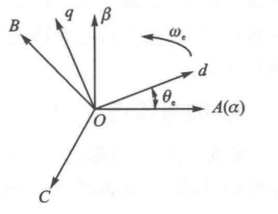
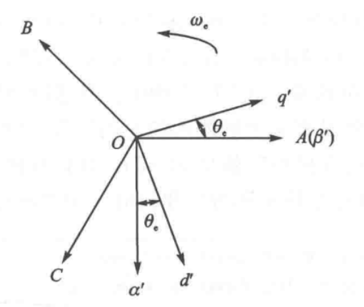
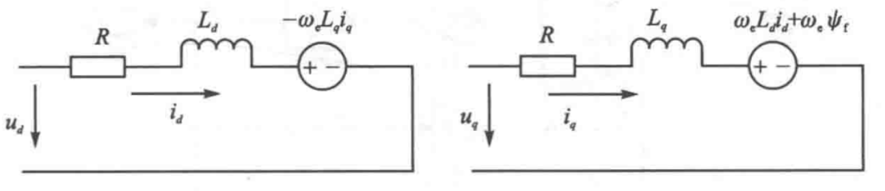

# 永磁同步电机的数学建模

## 写在前面

>本文为个人学习笔记，主要参考文献为  
>**《现代永磁同步电机控制原理及 MATLAB 仿真》—— 袁雷 编著**。
由于组里做的方向和电机相关，后续会写很多与电机相关的东西，无论是DSP 控制，还是电机控制算法设计，都离不开对电机数学模型的理解，所以先把数学模型的内容整理出来，方便后续查阅。
本文的逻辑和袁雷老师的书基本一致，但为了方便理解，做了一些调整和补充。
由于本人是**初学者**，难免有理解不到位的地方，欢迎各位大佬指正。😘😘😘

---

## 一、三相 PMSM 的基本数学模型

为简化分析，假设三相 PMSM 为**理想电机**，并满足以下条件：

- 忽略电机铁芯饱和
- 不计涡流和磁滞损耗
- 定子电流为对称三相正弦波

### 1.1 三相电压方程

在自然坐标系（\(ABC\)）下，三相 PMSM 的电压方程为：

$$
u_{3s} = R\,i_{3s} + \frac{d\psi_{3s}}{dt}
\tag{1}
$$

### 1.2 磁链方程

磁链方程表示为：

$$
\psi_{3s} = L_{3s} i_{3s} + \psi_f\, F_{3s}(\theta_e)
\tag{2}
$$

其中各变量定义如下：

$$
\begin{aligned}
i_{3s} &=
\begin{bmatrix}
i_A \\ i_B \\ i_C
\end{bmatrix}, \qquad
u_{3s} =
\begin{bmatrix}
u_A \\ u_B \\ u_C
\end{bmatrix}, \\[6pt]
\psi_{3s} &=
\begin{bmatrix}
\psi_A \\ \psi_B \\ \psi_C
\end{bmatrix}, \qquad
R_{3s} =
\begin{bmatrix}
R & 0 & 0 \\
0 & R & 0 \\
0 & 0 & R
\end{bmatrix},
\end{aligned}
$$

永磁体磁链分布函数为：

$$
F_{3s}(\theta_e) =
\begin{bmatrix}
\cos \theta_e \\
\cos\!\left(\theta_e - \frac{2\pi}{3}\right) \\
\cos\!\left(\theta_e + \frac{2\pi}{3}\right)
\end{bmatrix}
$$

定子电感矩阵为：

$$
L_{3s} =
L_{m3}
\begin{bmatrix}
1 & \cos\!\frac{2\pi}{3} & \cos\!\frac{4\pi}{3} \\
\cos\!\frac{2\pi}{3} & 1 & \cos\!\frac{2\pi}{3} \\
\cos\!\frac{4\pi}{3} & \cos\!\frac{2\pi}{3} & 1
\end{bmatrix}
+
L_{\sigma 3}
\begin{bmatrix}
1 & 0 & 0 \\
0 & 1 & 0 \\
0 & 0 & 1
\end{bmatrix}
$$

其中：  
\(L_{m3}\) 为三相定子互感，\(L_{\sigma 3}\) 为定子漏感。${\psi_f}$ 为永磁体磁链幅值，\(\theta_e\) 为电机电角度。

---

### 1.3 电磁转矩方程

根据机电能量转换原理，电磁转矩等于磁共能对机械角的偏导数：

$$
T_e =
\frac{p_n}{2}
\frac{\partial}{\partial \theta_m}
\left(
i_{3s}^{\mathrm{T}} \psi_{3s}
\right)
\tag{3}
$$

其中 \(p_n\) 为电机极对数。

在这里补充一个，机械角 \(\theta_m\) 与电角 \(\theta_e\) 的关系为：

$$
\theta_e = \frac{p_n}{2} \theta_m
$$

>电角度（Electrical angle）是用来描述“定子旋转磁场相位”的角度，而不是转子在物理空间里转了多少。

---

### 1.4 机械运动方程

电机的机械运动方程为：

$$
J \frac{d\omega_m}{dt} =
T_e - T_L - B\,\omega_m
\tag{4}
$$

其中：

- \(J\)：转动惯量  
- \(\omega_m\)：机械角速度  
- \(T_L\)：负载转矩  
- \(B\)：粘性阻尼系数  

---

## 二、PMSM 的坐标变换

为简化数学模型，通常采用坐标变换方法，将三相静止坐标系下的模型转换到两相旋转坐标系。

其中：  
\(ABC\) 为自然坐标系，\(\alpha\beta\) 为两相静止坐标系，\(dq\) 为同步旋转坐标系。

---

### 2.1 Clarke 变换

Clarke 变换用于将三相坐标系变量变换到两相静止坐标系：

$$
\begin{bmatrix}
f_\alpha \\
f_\beta \\
f_0
\end{bmatrix} =
T_{3s/2s}
\begin{bmatrix}
f_A \\ f_B \\ f_C
\end{bmatrix}
\tag{5}
$$

其中：

$$
T_{3s/2s} =
\frac{2}{3}
\begin{bmatrix}
1 & -\frac{1}{2} & -\frac{1}{2} \\
0 & \frac{\sqrt{3}}{2} & -\frac{\sqrt{3}}{2} \\
\frac{1}{2} & \frac{1}{2} & \frac{1}{2}
\end{bmatrix}
$$

反 Clarke 变换为：

$$
\begin{bmatrix}
f_A \\ f_B \\ f_C
\end{bmatrix} =
T_{2s/3s}
\begin{bmatrix}
f_\alpha \\ f_\beta \\ f_0
\end{bmatrix}
\tag{6}
$$

$$
T_{2s/3s} =
\begin{bmatrix}
1 & 0 & \frac{\sqrt{2}}{2} \\
-\frac{1}{2} & \frac{\sqrt{3}}{2} & \frac{\sqrt{2}}{2} \\
-\frac{1}{2} & -\frac{\sqrt{3}}{2} & \frac{\sqrt{2}}{2}
\end{bmatrix}
$$

---

### 2.2 Park 变换

Park 变换将 \(\alpha\beta\) 坐标系变量变换到旋转坐标系：

$$
\begin{bmatrix}
f_d \\ f_q
\end{bmatrix} =
T_{2s/2r}
\begin{bmatrix}
f_\alpha \\ f_\beta
\end{bmatrix}
\tag{7}
$$

$$
T_{2s/2r} =
\begin{bmatrix}
\cos \theta_e & \sin \theta_e \\
-\sin \theta_e & \cos \theta_e
\end{bmatrix}
$$

反 Park 变换为：

$$
T_{2r/2s} =
\begin{bmatrix}
\cos \theta_e & -\sin \theta_e \\
\sin \theta_e & \cos \theta_e
\end{bmatrix}
\tag{8}
$$

---

### 2.3 综合坐标变换

综合 Clarke 与 Park 变换，有：

$$
\begin{bmatrix}
f_d \\ f_q
\end{bmatrix} =
T_{3s/2r}
\begin{bmatrix}
f_A \\ f_B \\ f_C
\end{bmatrix}
\tag{9}
$$

$$
T_{3s/2r} =
\frac{2}{3}
\begin{bmatrix}
\cos \theta_e &
\cos\!\left(\theta_e - \frac{2\pi}{3}\right) &
\cos\!\left(\theta_e + \frac{2\pi}{3}\right) \\
\sin \theta_e &
\sin\!\left(\theta_e - \frac{2\pi}{3}\right) &
\sin\!\left(\theta_e + \frac{2\pi}{3}\right)
\end{bmatrix}
$$

---

### 2.4 MATLAB 坐标系与理论坐标系的差异

MATLAB 中采用的坐标系与理论推导相比相差 **90° 电角度**：

其关系为：

$$
\begin{aligned}
\begin{bmatrix}
f_{\alpha'} \\ f_{\beta'}
\end{bmatrix}
&=
\begin{bmatrix}
0 & -1 \\ 1 & 0
\end{bmatrix}
\begin{bmatrix}
f_\alpha \\ f_\beta
\end{bmatrix}, \\[6pt]
\begin{bmatrix}
f_{d'} \\ f_{q'}
\end{bmatrix}
&=
\begin{bmatrix}
0 & -1 \\ 1 & 0
\end{bmatrix}
\begin{bmatrix}
f_d \\ f_q
\end{bmatrix}.
\end{aligned}
$$

对应的 MATLAB Clarke 与 Park 变换矩阵分别为：

$$
T_{3s/2s}' =
\frac{2}{3}
\begin{bmatrix}
-\frac{1}{2} & -\frac{1}{2} & 1 \\
\frac{\sqrt{3}}{2} & -\frac{\sqrt{3}}{2} & 0
\end{bmatrix}
$$

$$
T_{2s/2r}' =
\begin{bmatrix}
\sin \theta_e & -\cos \theta_e \\
\cos \theta_e & \sin \theta_e
\end{bmatrix}
$$

$$
T_{3s/2r}' =
\frac{2}{3}
\begin{bmatrix}
\sin \theta_e &
\sin\!\left(\theta_e - \frac{2\pi}{3}\right) &
\sin\!\left(\theta_e + \frac{2\pi}{3}\right) \\
-\cos \theta_e &
-\cos\!\left(\theta_e - \frac{2\pi}{3}\right) &
-\cos\!\left(\theta_e + \frac{2\pi}{3}\right)
\end{bmatrix}
$$

---

## 三、PMSM 在 \(dq\) 坐标系下的数学模型

可列出 PMSM 在 \(dq\) 坐标系下的数学模型，其用定子电压方程可表示为：

$$
\begin{cases}
u_d = R\,i_d + \dfrac{d\psi_d}{dt} - \omega_e\,\psi_q, \\
u_q = R\,i_q + \dfrac{d\psi_q}{dt} + \omega_e\,\psi_d.
\end{cases}
\tag{10}
$$

针对上式，$\dfrac{d\psi_d}{dt}$ 表示的是最基本的电磁学关系

> 电压 = 磁链的时间变化率，任何坐标系，只要磁链变，就一定会有电压

同时，在旋转坐标系中，向量的时间导数并不是普通倒数，而是

$$
\frac{d\psi}{dt} = \left( \frac{d\psi}{dt} \right)_{\text{静止}} + \omega_e \times \psi
$$

因此在 $dq$ 坐标系下，电压方程中会多出与转速 $\omega_e$ 相关的交叉项。
其中$\omega_e \times \psi$就是我们所看见的公式后面的那一项

>这项不是损耗，不是反电势本身，而是“坐标变换引入的速度耦合项”
>但在稳态下，它数值上等价于反电势贡献。

定子磁链方程为

$$
\begin{cases}
\psi_d = L_d\, i_d + \psi_f, \\
\psi_q = L_q\, i_q.
\end{cases}
\tag{11}
$$

我们可以发现，在$d$轴下，会多出来一项$\psi_f$，这就是永磁体磁链的贡献。
因为$d$轴**始终跟着永磁体磁极方向旋转**，而永磁体在这个坐标系下是大小恒定，方向固定，完全落在$d$轴上。
将式10、11合并可得：

$$
\begin{bmatrix}
u_d \\ u_q
\end{bmatrix} =
\begin{bmatrix}
R & \omega_e L_q \\
-\omega_e L_d & R
\end{bmatrix}
\begin{bmatrix}
i_d \\ i_q
\end{bmatrix} +
\frac{d}{dt}
\begin{bmatrix}
L_d & 0 \\ 0 & L_q
\end{bmatrix}
\begin{bmatrix}
i_d \\ i_q
\end{bmatrix} +
\begin{bmatrix}
0 \\ \omega_e \psi_f
\end{bmatrix}
\tag{12}
$$

其中:$u_d, u_q$ 为定子电压 ($dq$ 坐标系)；$i_d, i_q$ 为定子电流($dq$ 坐标系)；$\psi_d, \psi_q$ 为磁链；$\omega_e$ 为电角速度。$L_d, L_q$ 分别为定子 $d$ 轴和 $q$ 轴电感；$\psi_f$ 为永磁体磁链。

根据上式可得出点压等效电路如上图所示，此时电磁转矩方程为：

$$
T_e = \frac{3}{2} p_n \left[ \psi_f i_q + (L_d - L_q) i_d i_q \right]
\tag{13}
$$

其中：$p_n$ 为电机极对数。
对于表贴式永磁同步电机，$L_d = L_q$，则电磁转矩方程简化为：

$$
T_e = \frac{3}{2} p_n \psi_f i_q
\tag{14}
$$

同时在仿真时，有几个重要的关系式：

$$
\begin{cases}
\omega_e = n_p\,\omega_m, \\[4pt]
N_r = \dfrac{30}{\pi}\,\omega_m, \\[6pt]
\theta_e = \displaystyle \int \omega_e \, dt.
\end{cases}
$$

其中：$n_p$ 为电机极对数，$N_r$ 为转速（单位：rpm），$\omega_m$ 为机械角速度（单位：rad/s），$\theta_e$ 为电机电角度。

---

## 四、PMSM 在 ($\alpha \beta$) 坐标系下的数学模型

要获得 PMSM 在 ($\alpha \beta$) 坐标系下的数学模型，可将 $dq$ 坐标系下的数学模型通过反 Park 变换转换而来，可得到：

$$
\begin{bmatrix}
u_\alpha \\
u_\beta
\end{bmatrix}=
\underbrace{
\begin{bmatrix}
R & 0 \\
0 & R
\end{bmatrix}
\begin{bmatrix}
i_\alpha \\
i_\beta
\end{bmatrix}
}_{\text{电阻项}}
+
\underbrace{
\frac{d}{dt}
\left(
\begin{bmatrix}
L_\alpha & L_{\alpha\beta} \\
L_{\alpha\beta} & L_\beta
\end{bmatrix}
\begin{bmatrix}
i_\alpha \\
i_\beta
\end{bmatrix}
\right)
}_{\text{电感项}}
+
\underbrace{
\omega_e \psi_f
\begin{bmatrix}
-\sin\theta_e \\
\cos\theta_e
\end{bmatrix}
}_{\text{永磁反电势}}
\tag{15}
$$

其中：$L_\alpha, L_\beta$ 为定子在 $\alpha \beta$ 坐标系下的电感。$i_\alpha, i_\beta$ 为定子电流 ($\alpha \beta$ 坐标系)；$u_\alpha, u_\beta$ 为定子电压 ($\alpha \beta$ 坐标系)。
且满足下式

$$
\begin{cases}
L_\alpha = L_0 + L_1 \cos(2\theta_e), \\[4pt]
L_\beta = L_0 - L_1 \cos(2\theta_e), \\[4pt]
L_{\alpha\beta} = L_1 \sin(2\theta_e), \\[6pt]
L_0 = \dfrac{L_d + L_q}{2}, \\[6pt]
L_1 = \dfrac{L_d - L_q}{2}.
\end{cases}
\tag{16}
$$

其中，$L_0$ 为平均电感，$L_1$ 为磁阻各向异性强度。

观察式15，$\theta_e$是来源于永磁体，它决定了永磁体磁链在$\alpha \beta$坐标系下的投影方向。传统反电动势法、PLL、SMO等位置估计方法，都是基于这个原理进行的。

观察式16，$2\theta_e$完全来自电感不对称。这是因为电机的$d$轴和$q$轴电感不同，在$\alpha \beta$坐标系下，电感矩阵会随着永磁体转动而周期性变化，变化周期为180°电角度（即$\pi$弧度），因此出现了$2\theta_e$。
高频注入、磁阻法等位置估计方法，都是基于这个原理进行的。

但由于包含了$\theta_e$和$2\theta_e$两项，使得$\alpha \beta$坐标系下的数学模型变得非常复杂，所以先重写式15，整理如下:

$$
\begin{aligned}
\begin{bmatrix}
u_\alpha \\
u_\beta
\end{bmatrix}
&=
R
\begin{bmatrix}
i_\alpha \\
i_\beta
\end{bmatrix}
+
\frac{d}{dt}
\left(
L_0
\begin{bmatrix}
i_\alpha \\
i_\beta
\end{bmatrix}
\right) \\[6pt]
&\quad+
\frac{d}{dt}
\left(
L_1
\begin{bmatrix}
\cos 2\theta_e & \sin 2\theta_e \\
\sin 2\theta_e & -\cos 2\theta_e
\end{bmatrix}
\begin{bmatrix}
i_\alpha \\
i_\beta
\end{bmatrix}
\right) \\[6pt]
&\quad+
\omega_e \psi_f
\begin{bmatrix}
-\sin \theta_e \\
\cos \theta_e
\end{bmatrix}
\end{aligned}
\tag{17}
$$

再将$dq$轴下的电压方程重写为

$$
\begin{bmatrix}
u_d \\
u_q
\end{bmatrix}=
\begin{bmatrix}
R + \dfrac{d}{dt}L_d & -\omega_e L_q \\
\omega_e L_d & R + \dfrac{d}{dt}L_q
\end{bmatrix}
\begin{bmatrix}
i_d \\
i_q
\end{bmatrix}
+
\begin{bmatrix}
0 \\
(L_d - L_q)\!\left(\omega_e i_d - \dfrac{d i_q}{dt}\right) + \omega_e \psi_f
\end{bmatrix}
\tag{18}
$$

并变换到静止坐标系$\alpha \beta$：

$$
\begin{aligned}
\begin{bmatrix}
u_\alpha \\
u_\beta
\end{bmatrix}
&=
\underbrace{
\begin{bmatrix}
R + \dfrac{d}{dt}L_d & \omega_e (L_d - L_q) \\
-\omega_e (L_d - L_q) & R + \dfrac{d}{dt}L_d
\end{bmatrix}
\begin{bmatrix}
i_\alpha \\
i_\beta
\end{bmatrix}
}_{\text{电阻 + 等效电感 + 磁阻耦合}}
\\[10pt]
&\quad+
\underbrace{
\Big[
(L_d - L_q)\big(\omega_e i_d - \dot{i}_q\big)
+
\omega_e \psi_f
\Big]
\begin{bmatrix}
-\sin\theta_e \\
\cos\theta_e
\end{bmatrix}
}_{\text{位置相关激励项}}
\end{aligned}
\tag{19}
$$

针对上式，有很多可以说的点
**第一部分：矩阵乘电流项**
1.对角线项：$R + \dfrac{d}{dt}L_d$

- $Ri$ : 电阻压降
- $\dfrac{d}{dt}L_d i$ : 电感动态

> 定义了系统的动态响应特性,本质上就是一个RL系统

2.非对角线项：$\pm \omega_e (L_d - L_q)$
其中最关键的一项是
$$\omega_e (L_d - L_q)$$
它代表的是：
> 磁阻各向异性 + 转速 → 轴间耦合

- 表贴式 PMSM（SPMSM）：$L_d = L_q$，无轴间耦合  
- 内嵌式 PMSM/同步磁阻电机：$L_d \ne L_q$，有轴间耦合

**第二部分：位置相关激励项**
1.永磁体反电势：$\omega_e \psi_f$
这一项在上面已经提到

2.磁阻相关激励：$(L_d - L_q)\big(\omega_e i_d - \dot{i}_q\big)$
这一项只在内嵌式 PMSM/同步磁阻电机中存在。

静止坐标系下的电磁转矩方程可以表示为：

$$
T_e=
\frac{3}{2}\,p_n\!\left(
\psi_\alpha\, i_\beta-
\psi_\beta\, i_\alpha
\right)
\tag{20}
$$

定子磁链方程为：

$$
\begin{cases}
\dfrac{d\psi_\alpha}{dt} = u_\alpha - R\,i_\alpha, \\
\dfrac{d\psi_\beta}{dt} = u_\beta - R\,i_\beta.
\end{cases}
$$

其中：$\psi_\alpha, \psi_\beta$ 为定子磁链 ($\alpha \beta$ 坐标系)。
磁链的幅值为：

$$
\psi_s = \sqrt{\psi_\alpha^2 + \psi_\beta^2}
\tag{21}
$$

在这里给出静止坐标系下的电流方程，但不做解释：

$$
\frac{d i_\alpha}{dt}=
\frac{1}{L_d}\,\omega_m \psi_\beta+
\left(u_\alpha - R i_\alpha\right)
\left(
\frac{1}{L_d}\cos^2\theta_m+
\frac{1}{L_q}\sin^2\theta_m
\right)+
\frac{1}{2}
\left(u_\beta - R i_\beta\right)
\sin 2\theta_m
\left(
\frac{1}{L_d}-
\frac{1}{L_q}
\right)
$$

$$
\frac{d i_\beta}{dt}=
\frac{1}{L_d}\,\omega_m \psi_\alpha+
\left(u_\beta - R i_\beta\right)
\left(
\frac{1}{L_d}\sin^2\theta_m+
\frac{1}{L_q}\cos^2\theta_m
\right)+
\frac{1}{2}
\left(u_\alpha - R i_\alpha\right)
\sin 2\theta_m
\left(
\frac{1}{L_d}-
\frac{1}{L_q}
\right)
$$

其中:

$$
\psi_\alpha=
\frac{L_d}{L_q}\,\psi_f \cos\theta_m-
\left(
1 - \frac{L_d}{L_q}
\right)
L_0
\left(
i_\alpha \cos 2\theta_m+
i_\beta \sin 2\theta_m
\right)+
L_2 i_\alpha
$$

$$
\psi_\beta=
\frac{L_d}{L_q}\,\psi_f \sin\theta_m-
\left(
1 - \frac{L_d}{L_q}
\right)
L_0
\left(
i_\beta \cos 2\theta_m+
i_\alpha \sin 2\theta_m
\right)+
L_2 i_\beta
$$

静止坐标系下电机的机械运动方程为

$$
J\,\frac{d\omega_m}{dt}=
\psi_\alpha i_\beta-
\psi_\beta i_\alpha-
T_L
$$
$$
\frac{d\theta_m}{dt}=
\omega_m
$$

## 五、总结

本文整理了永磁同步电机的数学模型，分别在自然坐标系($ABC$)、两相静止坐标系($\alpha \beta$)和两相旋转坐标系($dq$)下进行了描述，并分析了各个坐标系下模型的特点和应用场景。理解这些数学模型对于电机控制算法的设计和实现具有重要意义。
希望本文能为从事电机控制研究和应用的读者提供有价值的参考。
